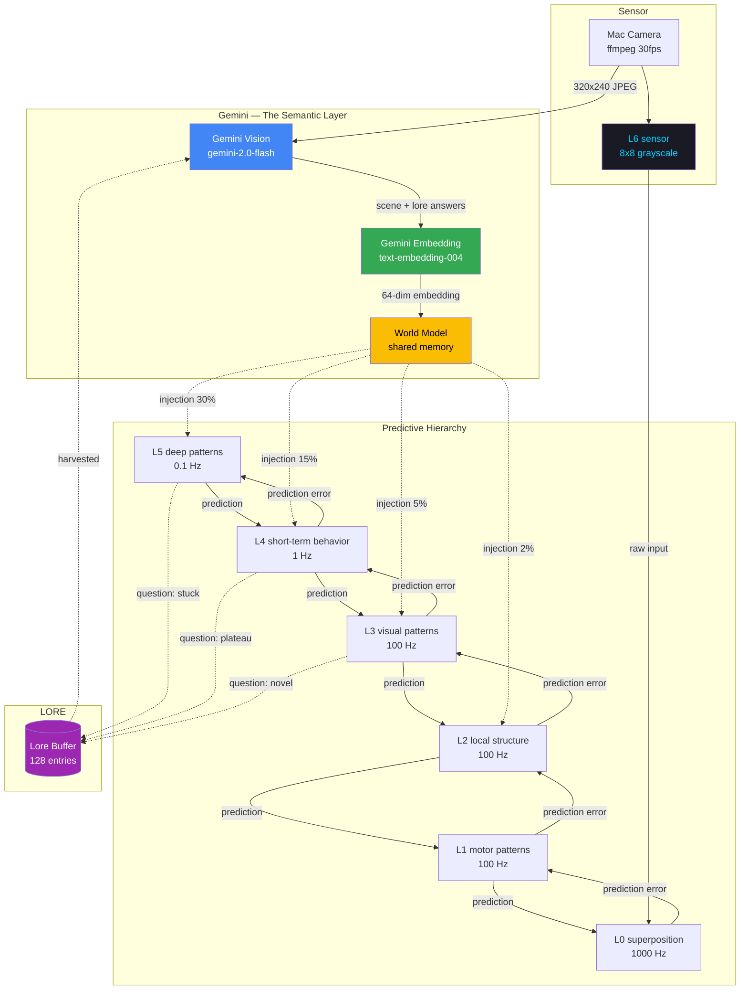
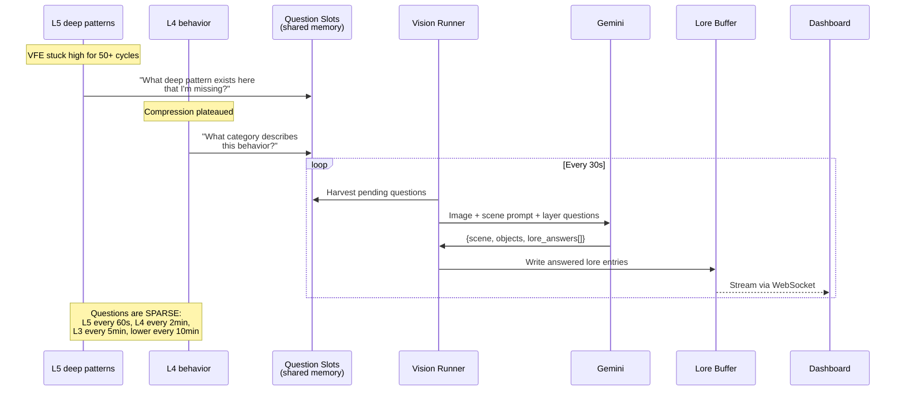
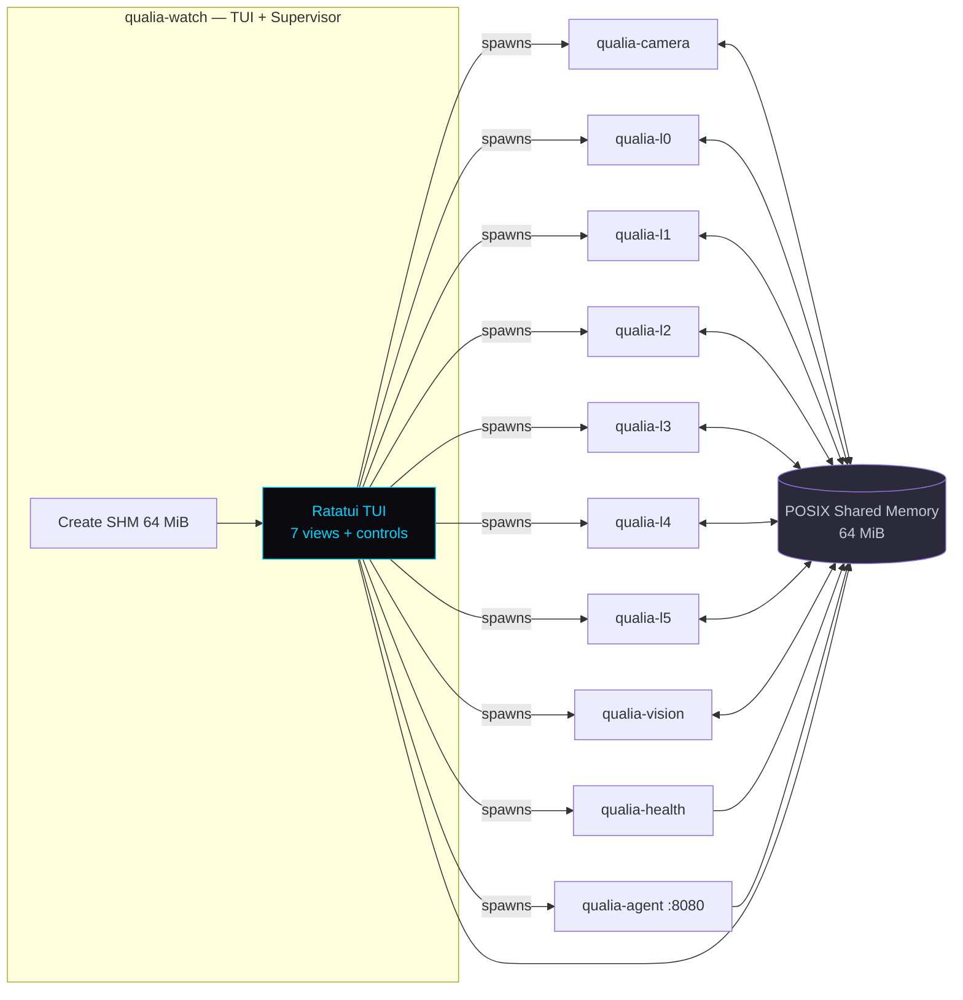
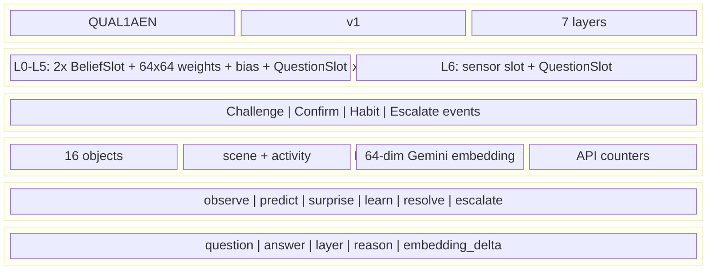
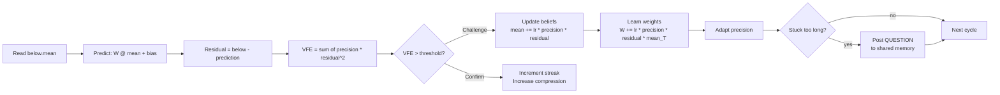
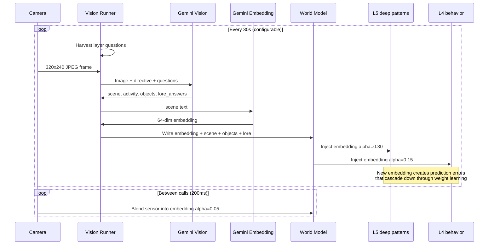

# Qualia Engine

A predictive coding architecture running 7 hierarchical layers on Apple Silicon Metal, with Google Gemini as the semantic embedding model that teaches the lower layers what to expect. Layers that can't resolve their own prediction errors ask questions to the outside world — the answers become **LORE**, accumulated world-knowledge that shapes future predictions.

## Prerequisites

### macOS (Apple Silicon required for Metal GPU)

```bash
# 1. Install Xcode Command Line Tools (for C compiler + Metal SDK)
xcode-select --install

# 2. Install Rust
curl --proto '=https' --tlsv1.2 -sSf https://sh.rustup.rs | sh
source "$HOME/.cargo/env"

# 3. Install ffmpeg (for webcam capture)
brew install ffmpeg

# 4. Get a Google Gemini API key
#    https://aistudio.google.com/apikey
#    Free tier works fine — Flash is cheap
export GEMINI_API_KEY="your-key-here"
```

### Jetson Orin Nano (CUDA)

```bash
# 1. Ensure JetPack 6.0+ is installed (includes CUDA toolkit)
nvcc --version   # should show CUDA 12.x

# 2. Install Rust
curl --proto '=https' --tlsv1.2 -sSf https://sh.rustup.rs | sh
source "$HOME/.cargo/env"

# 3. Install ffmpeg
sudo apt install ffmpeg

# 4. Get a Google Gemini API key (optional — runs offline without it)
export GEMINI_API_KEY="your-key-here"
```

### Verify your setup

```bash
rustc --version     # needs 1.75+
cargo --version
ffmpeg -version     # needs avfoundation support (macOS default)
# Metal is built-in on all Apple Silicon Macs — no driver needed
```

## Quick Start

```bash
# From the SensorForge repo root
cd qualia
cargo build --release

# Run — the TUI is the supervisor, spawns everything
export GEMINI_API_KEY="your-key-here"
cargo run --release --bin qualia-watch
```

That's it. The TUI creates shared memory, spawns all 10 runner processes, starts the webcam, and connects to Gemini. Press `q` to quit and cleanly shut everything down.

Without `GEMINI_API_KEY` it runs in offline mode with synthetic sensor data and hash-based embeddings — still useful for development.

## Architecture



## The LORE System

When a layer can't resolve its prediction errors on its own, it poses a question to the outside world. The vision runner harvests these questions and batches them into the next Gemini call. The answers become LORE — accumulated world-knowledge that persists in shared memory.



### Question Triggers

| Reason | Code | Trigger | Example |
|--------|------|---------|---------|
| STUCK | 0 | VFE > 5x threshold for 50+ cycles | "My predictions keep failing — what pattern am I missing?" |
| PLATEAU | 1 | Compression stalled, still challenged | "I learned something but can't simplify — what abstraction am I missing?" |
| NOVEL | 2 | Sudden VFE spike > 8x threshold | "Something new appeared — what changed?" |

## Process Architecture



## Shared Memory Layout



## Belief Update — Metal GPU Kernel

Each layer runs 64 GPU threads (one per dimension) on Apple Silicon Metal:



## How Gemini Teaches the Hierarchy



## TUI Controls

| Key | Action |
|-----|--------|
| `1`-`7` | Switch view mode |
| `j`/`k` or arrows | Select layer |
| `Tab` | Cycle views |
| `r` | Restart all runners |
| `q` / `Esc` / `Ctrl+C` | Quit and shutdown |

### View Modes

| # | View | What you see |
|---|------|--------------|
| 1 | Overview | Layer table: VFE, compression, streaks, challenge/confirm |
| 2 | Detail | Single layer deep dive — all 64 dimensions |
| 3 | Hex | Raw belief memory dump |
| 4 | Sparklines | VFE history for all layers |
| 5 | Residuals | Residual heatmap across dimensions |
| 6 | Weights | 64x64 weight matrix heatmap |
| 7 | World | Scene, objects, directive, Gemini embedding |

## Web Dashboard

Auto-launched at `http://localhost:8080` with real-time WebSocket streaming:

- Layer hierarchy with VFE coloring
- 16x16 weight matrix heatmap
- Belief vector heatmaps (mean, precision, prediction, residual)
- Scrolling volatility charts (VFE, challenge rate, residual energy)
- Thought stream
- **Lore Codex** — scrolling question/answer pairs from the layers
- Gemini API cost tracking with token breakdown and price graph
- Scene embedding 8x8 heatmap

## Environment Variables

| Variable | Default | Description |
|----------|---------|-------------|
| `GEMINI_API_KEY` | _(none)_ | Google Gemini API key. Without it, runs offline with synthetic data |
| `QUALIA_SHM_NAME` | `/qualia_body` | POSIX shared memory region name |
| `QUALIA_SOCK_PATH` | `/tmp/qualia_body.sock` | Unix domain socket for IPC |
| `QUALIA_WEB_PORT` | `8080` | Web dashboard port |
| `QUALIA_LLM_INTERVAL` | `30` | Seconds between Gemini API calls |
| `QUALIA_LLM_MAX_CALLS` | `50` | Max Gemini calls per session (budget) |
| `RUST_LOG` | `info` | Log level |

## Layer Reference

| Layer | Name | Hz | Role | Gemini Injection | Questions |
|-------|------|----|------|-----------------|-----------|
| L0 | Superposition | 1000 | Raw sensation | 0% | Every 10min |
| L1 | Motor | 100 | How things move | 0% | Every 10min |
| L2 | Local | 100 | Nearby structure | 2% | Every 10min |
| L3 | Visual | 100 | What things look like | 5% | Every 5min |
| L4 | Behavior | 1 | What's happening now | 15% | Every 2min |
| L5 | Deep | 0.1 | Persistent regularities | 30% | Every 1min |
| L6 | Sensor | 30 | Raw camera input | 0% | _(none)_ |

## Project Structure

```
qualia/
  crates/
    types/       repr(C) shared data structures
    shm/         POSIX shared memory with double-buffering
    ipc/         Unix domain socket control plane
    metal/       Apple Silicon Metal GPU compute
    cuda/        (stub) future NVIDIA support
  runners/
    watch/       TUI supervisor — entry point, spawns everything
    camera/      Webcam via ffmpeg -> L6
    vision/      Gemini Vision + Embedding + LORE answering
    agent/       Web dashboard (Axum + WebSocket)
    health/      10 Hz monitoring
    l0-superposition/  through  l5-behavior/
  kernels/
    belief_update.metal   GPU kernel
```

## License

MIT
